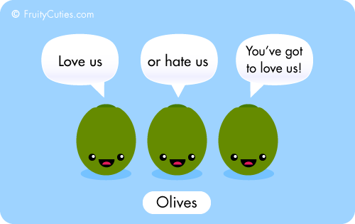
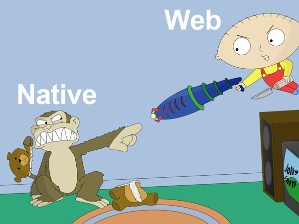
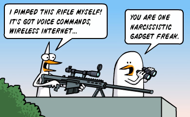
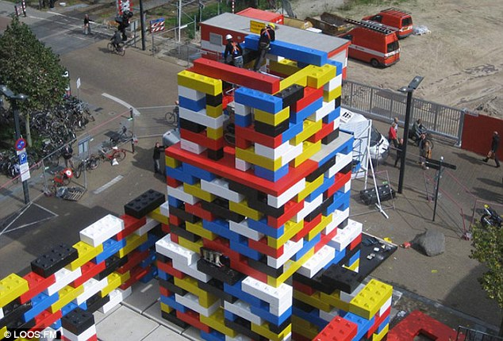

# NodeJS: Auth & Structure

---

## Our Presenters

## Eric Kryski

* GitHub: [ekryski.github.com](http://ekryski.github.com), Twitter: [@ekryski](http://twitter.com/ekryski)

## Olivier Wietrich

* GitHub: [@bredele](https://github.com/bredele), Twitter: [@bredeleca](http://twitter.com/bredeleca)

---

## Our Sponsors

## Assembly Co-working Space

## PetroFeed

---

## Our Sponsors

## Village Brewery

---

## Last Month

* What's Node and why should I use it?
* Basic server side programming
* [NodeJS](http://nodejs.org) 101
* CommonJS modules
* NodeJS Web Frameworks
* Web applications with [Express](http://expressjs.com)
* Persistent storage with [MongoDB](http://mongodb.org) using [MongoSkin](https://github.com/kissjs/node-mongoskin)
* User registration and login

---

## A Blog in 7 Lines with [Olives](http://flams.github.io/olives/)

Olives allows you to create real-time HTML5 applications, in no time!

 

---

## Native vs. Web

Still an on going debate but.... web is getting more hi-tech weapons

---

## New Web Weapons

* Faster browsers & faster devices (Moore's Law)
* WebGL & Hardware accelerated CSS
* [Emscripten](https://github.com/kripken/emscripten/wiki) & [asm.js](http://asmjs.org/)
* [ORBX.js](http://brendaneich.com/2013/05/today-i-saw-the-future/) & Websockets

---

## Desktop Web + Mobile Web = Hugz

You can now augment your desktop web experience with a mobile web device.

---

## QR Control

Qr control is a tiny library that allows you to remote control your browser from any device with WebSocket support.

<iframe class="center" width="560" height="315" src="http://www.youtube.com/embed/D7EFot_kmS0" frameborder="0" allowfullscreen></iframe>

---

## [Google's Rollit](http://chrome.com/campaigns/rollit)

Taking mobile augmented web experience to the next level. Who needs a wii anymore??

---

## Authenticating with [Passport](http://passportjs.org)

---

## NodeJS App Structure

---

## Validation/Middleware

 

---

## Next Month

* Client side MVWTF
* [CanJS](http://canjs.us) demo
* [Backbone](http://backbonejs.org/) demo
* [Meteor](http://meteor.com/)???
* More [Olives](http://flams.github.io/olives/)???
